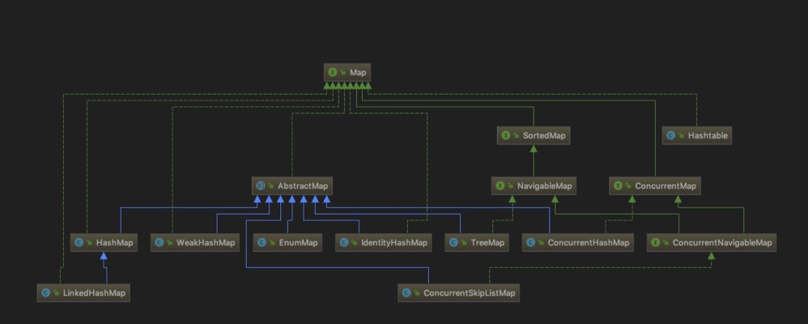
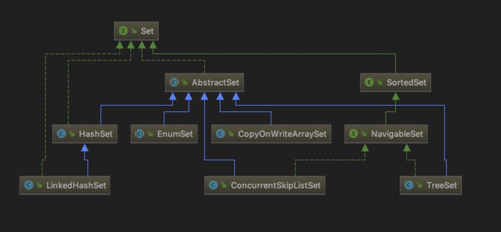

## JDK
	
### **1 Map :**

	|-- HashMap: 线程不安全，一个数组，数组的元素是一个Node
			|-- 数据结构：
					|-- 1.8前数组+链表
					|-- 1.8后数组+链表+红黑树
			|-- 默认容量16，负载因子0.75f，转树阀门8，转链阀门6
			|-- tableSizeFor():返回大于或者等于输入参数最接近的2的整数次幂的值
			|-- 利用key的hash值的高16位与低16位进行异或来降低hash的冲突
			|-- put()：
					|-- 1.8前插在头部，1.8之前是单链表，插在头部在并发情况下会出现死循环
					|-- 1.8后插在尾部，1.8之后是链表+红黑树，插在尾部避免多次遍历
			|-- get():先比较hash，若相等在比较equals
			|-- resize():
					|-- 1.8前扩容2倍，重新计算hash值 key%table.length -> key&(table.length-1)，复制到新数组
					|-- 1.8后扩容2倍，新增的bit位是0，不变；是1，原索引+oldCap
			|-- 元素顺序：
					|-- 1.8前不能保证元素次序不变
					|-- 1.8后元素次序不变
			|-- NULL可以做key和value
	|-- HashTable: 通过synchronized方法保证线程安全   
			|-- NULL不能做key和value
	|-- ConcurrentHashMap:线程安全
			|-- 数据结构：
					|-- 1.8前数组+Segment+数组+链表+分段锁(ReentrantLock)
					|-- 1.8后数组+链表+红黑树+CAS+Synchronized
			|-- 锁：
					|-- 1.7 并发度默认16
					|-- 对Node加锁
	|-- LinkedHashMap:继承HashMap  
			|-- 默认保存插入顺序排序
			|-- 构造方法可以指定访问次序排序
	|-- TreeHashMap：基于二叉树的红黑树，排序
	|-- WeakHashMap:    
	|-- ConcurrentSkipListMap:    

### **2 Set :**

	|-- HashSet:一个 hashCode 位置上可以存放多个元素  
	|-- LinkedHashSet: HashSet+LinkedHashMap
	|-- TreeSet:自己定义的类必须实现 Comparable 接口，并且覆写相应的 compareTo()函数
	|-- CopyOnWriteArraySet:    
	|-- ConcurrentSkipListSet:    

### **3 List :**

	|-- ArrayList: 线程不安全，默认大小10，扩容：new = old+old>>1
	|-- LinkedList: 小于size>>1，从first开始找，大于size>>1，从last开始找   
	|-- ArrayLinkedList:    
	|-- Vector:线程安全，数组，默认大小10，扩容：new = old*2
		|-- 缺点：
			 |-- 1 效率低
			 |-- 2 扩容2倍
			 |-- 3 数组，连续空间    
	|-- Stack:继承Vector，替代Deque
		|-- 缺点：
			 |-- 1 Vector的缺点
			 |-- 2 Vector提供了add方法，打破了Stack进出的规则  
	|-- CopyOnWriteArrayList:增删改加了锁，读没加锁，支持读多写少

### **4 Queue :**
   
 
	|-- LinkedList:    
	|-- PriorityQueue:优先级队列
	|-- ConcurrentLinkedQueue:基于链表的并发队列
			|-- 是一个适用于高并发场景下的队列，通过无锁的方式，实现了高并发状态下的高性能。
				该队列的元素遵循先讲先出的原则。头是最先加入的，尾是最近加入的，该队列不允许null元素    
	|-- LinkedTransferQueue:   
    线程相关：
	|-- ArrayBlockingQueue: 基于数组的并发阻塞队列
	|-- LinkedBlockingQueue: 基于链表的FIFO阻塞队列
	|-- PriorityBlockingQueue: 带优先级的无界阻塞队列
	|-- DelayQueue:延期阻塞队列
	|-- SynchronousQueue:并发同步阻塞队列
	双向队列:
	|-- ArrayDeque:数组双端队列
	|-- ConcurrentLinkedDeque:
	|-- LinkedBlockingDeque:基于链表的FIFO双端阻塞队列
			|-- 是一个线程安全的双端队列实现，可以说他是最为复杂的一种队列，在内部实现维护了前端和后端节点，
				但是其没有实现读写分离，因此同一时间只能有一个线程对其讲行操作

### **5 Object**

	equals():比较的是两个对象的地址，绝对可靠
	hashCode():返回其所在对象的物理地址hashCode，不绝对可靠
	toString():默认输出对象地址
	wait():拥有当前锁的线程会释放该线程锁，并处于等待状态（等待重新获取锁）
	notify():唤醒处于等待状态线程获取线程锁——随机唤醒其中之一
	notifyAll():唤醒处于等待状态线程获取线程锁——唤醒所有处于等待状态的线程抢夺线程锁
	clone()：浅拷贝【深拷贝的两种方法：1 实现Cloneable接口并覆写clone方法；2 序列化】

### **6 基本类型缓存池**

	Byte，Short，Long，Integer的缓存池范围默认都是: -128 到 127
	Character的缓存池范围是 0 到 127
	Integer 可以通过参数改变范围外，其它的都不行

