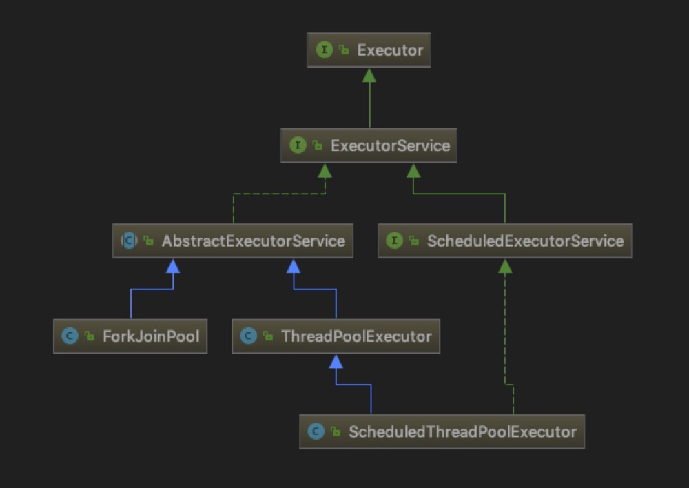

## 并发（锁/多线程）

### **1.JUC（java.util.concurrent）**  
	
	1.locks : 锁
	2.atomic : 原子操作
	3.Executor : 线程池
	4.Queue : 阻塞队列
	5.Concurrent Collections : 并发集合

### **2.锁**

#### **2.1 volatile**

	Java 内存模型中的可见性、原子性和有序性的基本概念：
		1.可见性，是指线程之间的可见性，一个线程修改的状态对另一个线程是可见的
		2.原子性，原子是世界上的最小单位，具有不可分割性
		3.有序性，Java 语言提供了 volatile（禁止指令重排序） 和 synchronized 两个关键字来保证线程之间操作的有序性
	
	声明变量是 volatile 的，JVM 保证了每次读变量都从内存中读，跳过 CPU cache 这一步
		1.保证此变量对所有的线程的可见性
		2.禁止指令重排序优化
		
	volatile 性能:
		volatile 的读性能消耗与普通变量几乎相同，但是写操作稍慢

#### **2.2 synchronized**

***应用方式：***  

|方 式|描 述|
|---|---|
|修饰实例方法|作用于当前实例加锁，进入同步代码前要获得当前 **实例** 的锁|
|修饰静态方法|作用于当前类对象加锁，进入同步代码前要获得当前 **类对象** 的锁|
|修饰代码块|指定加锁对象，对给定对象加锁，进入同步代码库前要获得 **给定对象** 的锁|

***锁的状态：***

|锁类型 | 描 述|
|----|---|
| 偏向锁 |只需要在Mark Word中CAS记录owner（本质上也是更新，但初始值为空) 减少无竞争且只有一个线程使用锁的情况下，使用轻量级锁产生的性能消耗。|
|轻量级锁| 不需要申请互斥量，仅仅将Mark Word中的部分字节CAS更新指向线程栈中的Lock Record 如果更新成功，则轻量级锁获取成功，记录锁状态为轻量级锁； 否则，说明已经有线程获得了轻量级锁，目前发生了锁竞争（不适合继续使用轻量级锁） 接下来膨胀为重量级锁 减少无实际竞争情况下，使用重量级锁产生的性能消耗。|
|自旋锁 自适应自旋锁| 当前线程竞争锁失败时，打算阻塞自己 不直接阻塞自己，而是自旋（空等待，比如一个空的有限for循环）一会 在自旋的同时重新竞争锁 如果自旋结束前获得了锁，那么锁获取成功；否则，自旋结束后阻塞自己 减少线程阻塞造成的线程切换|
|重量级锁|监视器锁（monitor）  成本非常高，包括系统调用引起的内核态与用户态切换、线程阻塞造成的线程切换等|

***锁的膨胀过程：***

PS：synchronized 可重入，非公平锁

#### **2.3 Lock**

|实现|描述|
|---|---|
|ReentrantLock| 可重入锁，除了能完成 synchronized 所能完成的所有工作外，还提供了诸如可响应中断锁、可轮询锁请求、定时锁等避免多线程死锁的方法|
|ReentrantReadWriteLock|读写锁，写写/读写互斥，读读不互斥 |

	Condition：  
		1.Condition 类的 awiat 方法和 Object 类的 wait 方法等效
		2.Condition 类的 signal 方法和 Object 类的 notify 方法等效
		3.Condition 类的 signalAll 方法和 Object 类的 notifyAll 方法等效
		4.ReentrantLock 类可以唤醒指定条件的线程，而 object 的唤醒是随机的

PS：ReentrantLock 与 synchronized的区别

	1.ReentrantLock显示锁，需要主动unlock()
	2.ReentrantLock 可中断、公平锁、多个锁
	
PS 2：ReentrantLock 代替 synchronized

	1.在确实需要一些 synchronized 所没有的特性的时候，比如时间锁等候、可中断锁等候、无块结构锁、多个条件变量或者轮询锁
	2.性能差距已经不大，synchronized优化的空间更大
	
#### **2.4 其他锁**

|名词|描述|
|---|---|
|悲观锁| synchronized|
|乐观锁| CAS |
|公平锁| 加锁前检查是否有排队等待的线程，优先排队等待的线程，先来先得|
|非公平锁| 加锁时不考虑排队等待问题，直接尝试获取锁，获取不到自动到队尾等待|
|独占锁|每次只能有一个线程能持有锁，ReentrantLock 就是以独占方式实现的互斥锁 |
|共享锁|  允许多个线程同时获取锁，并发访问共享资源|
|可重入锁(递归锁)| 指的是同一线程 外层函数获得锁之后 ，内层递归函数仍然有获取该锁的代码，但不受影响|
|活锁| 多个相互协作的线程间，为了彼此间的响应而相互礼让，使得没有一个线程能够继续前进（Paxos）|
|死锁| 多个进程在运行过程中因争夺资源而造成的一种僵局 **产生死锁的必要条件：**  互斥条件：进程要求对所分配的资源进行排它性控制，即在一段时间内某资源仅为一进程所占用。 请求和保持条件：当进程因请求资源而阻塞时，对已获得的资源保持不放。 不剥夺条件：进程已获得的资源在未使用完之前，不能剥夺，只能在使用完时由自己释放。 环路等待条件：在发生死锁时，必然存在一个进程--资源的环形链。 **预防死锁：** 资源一次性分配：一次性分配所有资源，这样就不会再有请求了：（破坏请求条件） 只要有一个资源得不到分配，也不给这个进程分配其他的资源：（破坏请保持条件） 可剥夺资源：即当某进程获得了部分资源，但得不到其它资源，则释放已占有的资源（破坏不可剥夺条件） 资源有序分配法：系统给每类资源赋予一个编号，每一个进程按编号递增的顺序请求资源，释放则相反（破坏环路等待条件）|

#### **2.5 AQS**

	 AbstractQueuedSynchronizer :抽象的队列式的同步器
	 CLH(Craig, Landin, and Hagersten locks): 是一个自旋锁，能确保无饥饿性，提供先来先服务的公平性

### **3.ThreadLocal**  

	ThreadLocal是一个本地线程副本变量工具类。
	主要用于将私有线程和该线程存放的副本对象做一个映射，各个线程之间的变量互不干扰，
	在高并发场景下，可以实现无状态的调用，特别适用于各个线程依赖不通的变量值完成操作的场景。
	
	Hash冲突解决：
	ThreadLocalMap结构非常简单，采用线性探测的方式。
	所谓线性探测，就是根据初始key的hashcode值确定元素在table数组中的位置，
	如果发现这个位置上已经有其他key值的元素被占用，则利用固定的算法寻找一定步长的下个位置，依次判断，直至找到能够存放的位置

	问题1:发送冲突，效率低
	问题2:内存泄漏
		由于ThreadLocalMap的key是弱引用，而Value是强引用。
		这就导致了一个问题，ThreadLocal在没有外部对象强引用时，发生GC时弱引用Key会被回收，
		而Value不会回收，如果创建ThreadLocal的线程一直持续运行，
		那么这个Entry对象中的value就有可能一直得不到回收，发生内存泄露。

### **4.线程池** 

#### **4.1 构造方法：**

    //ThreadPoolExecutor构造方法：
    public ThreadPoolExecutor(
    	int corePoolSize, // 线程池长期维持的线程数，即使线程处于Idle状态，也不会回收。
    	int maximumPoolSize, // 线程数的上限
    	long keepAliveTime, // 超过corePoolSize的线程的idle时长，
    	TimeUnit unit, // 超过这个时间，多余的线程会被回收。
    	BlockingQueue<Runnable> workQueue, // 任务的排队队列
    	ThreadFactory threadFactory, // 新线程的产生方式
    	RejectedExecutionHandler handler) // 拒绝策略
    	
	//ForkJoinPool构造方法：
	public ForkJoinPool(int parallelism, // 默认是cpu核心数
                        ForkJoinWorkerThreadFactory factory, // 默认实现是DefaultForkJoinWorkerThreadFactory
                        UncaughtExceptionHandler handler, //处理工作线程未处理的异常，默认为null
                        boolean asyncMode) //队列工作模式，FIFO_QUEUE : LIFO_QUEUE
    
#### **4.2 Executors工具类：**

|方法名|功能|
|---|---|
| **ThreadPoolExecutor** | |
|newFixedThreadPool(int nThreads)	|创建固定大小的线程池|
|newSingleThreadExecutor()|创建只有一个线程的线程池|
|newCachedThreadPool()|创建一个不限线程数上限的线程池，任何提交的任务都将立即执行|
| **ScheduledThreadPoolExecutor** | |
|newScheduledThreadPool(int corePoolSize) |支持定时及周期性的任务执行的线程池|
| **ForkJoinPool** | *工作窃取模式* |
|newWorkStealingPool(int parallelism) |无限队列来保存需要执行的任务，分治法来解决问题 |
|newWorkStealingPool()|让其中的线程创建新的任务，并挂起当前的任务， 此时线程就能够从队列中选择子任务执行 |

#### **4.3 WorkQueue：**

|方法名|功能|
|---|---|
| ArrayBlockingQueue | 基于数组的阻塞队列实现，在ArrayBlockingQueue内部，维护了一个定长数组，以便缓存队列中的数据对象，其内部没实现读写分离，也就意味着生产和消费不能完全并行，长度是需要定义的，可以指定先讲先出或者先讲后出，也叫有界队列，在很多场合非常适合使用.|
| LinkedBlockingQueue | 基于链表的阻塞队列，同ArrayBlockingQueue类似，其内部也维持着一个数据缓冲队列〈该队列由一个链表构成），LinkedBlockingQueue之所以能够高效的处理并发数据，是因为其内部实现采用分离锁（读写分离两个锁），从而实现生产者和消费者操作的完全并行运行,他是一个无界队列 |
| PriorityBlockingQueue | 基于优先级的阻塞队列（优先级的判断通过构造函数传入的Compator对象来决定，也就是说传入队列的对象必须实现Comparable接口），在实现PriorityBlockingQueue时，内部控制线程同步的锁采用的是公平锁，他也是一个无界的队列|
| DelayQueue | 带有延迟时间的Queue，其中的元素只有当其指定的延迟时间到了，才能够从队列中获取到该元素。DelayQueue中的元素必须实现Delayed接口，DelayQueue是一个没有大小限制的队列，应用场景很多，比如对缓存超时的数据进行移除、任务超时处理、空闲连接的关闭等等|
| SynchronousQueue | 一种没有缓冲的队列，生产者产生的数据直接会被消费者获取并消费|

#### **4.4 Runnable和Callable：**

	1.方法签名不同，void Runnable.run(), V Callable.call() throws Exception
	2.是否允许有返回值，Callable允许有返回值
	3.是否允许抛出异常，Callable允许抛出异常

|提交方式|返回结果|
|---|---|
|`Future<T> submit(Callable<T> task)`|是|
|`void execute(Runnable command)`|否|
|`Future<?> submit(Runnable task)`|否，虽然返回Future，但是其get()方法总是返回null|

#### **4.5 线程结果：**  

	CountDownLatch ：闭锁，一个或多个线程等待一组事件的产生
	CyclicBarrier ：栅栏，阻塞一组线程直到某个事件的发生
		栅栏与闭锁的关键区别在于，所有的线程必须同时到达栅栏位置，才能继续执行。闭锁用于等待事件，而栅栏用于等待其他线程
		CountDownLatch需要主线程，主线程等待子线程执行事件完成，计数器-1，直到=0，主线程执行接下来的动作
		CyclicBarrier不需要主线程，各个执行线程，执行到栅栏处，计数器+1，直到=parties，各个执行线程可以执行接下来的动作
		
	ExecutorService.invokeAll() ：在所有任务完成或超时到期后，该方法返回Future对象列表
	ExecutorCompletionService ： 异步获取并行任务执行结果
		与invokeAll（）的一个区别是返回表示执行任务的Futures的顺序。
		ExecutorCompletionService使用队列按结束顺序存储结果
		invokeAll（）返回一个列表，该列表具有与给定任务列表的迭代器生成的顺序相同的顺序

#### **4.6 RejectedExecutionHandler 拒绝策略**

|拒绝策略|	拒绝行为|
|---|---|
|AbortPolicy	|抛出RejectedExecutionException|
|DiscardPolicy	|什么也不做，直接忽略|
|DiscardOldestPolicy	|丢弃执行队列中最老的任务，尝试为当前提交的任务腾出位置|
|CallerRunsPolicy|	直接由提交任务者执行这个任务|

#### **4.7 线程池关键问题**

	1.核心线程（corePoolSize）跑满，且队列(workQueue)满的时候才会新建线程(maximumPoolSize)
	2.一般情况下，代码中只会去捕捉RuntimeException，如果抛出Error则会导致线程退出，而异常信息又没有拿到
		最佳的解决办法是给线程池设置UncaughtExceptionHandler

