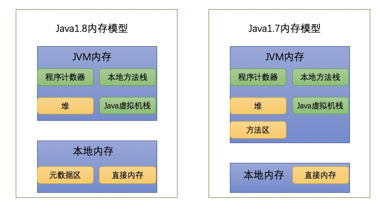

## **JVM**

	JVM(Java Virtual Machine,Java虚拟机），它是一个虚构出来的计算机
	JRE(JavaRuntimeEnvironment,Java运行环境)，也就是Java平台。
		所有的Java 程序都要在JRE下才能运行。普通用户只需要运行已开发好的java程序，安装JRE即可。
	JDK(Java Development Kit)是程序开发者用来来编译、调试java程序用的开发工具包。
		JDK的工具也是Java程序，也需要JRE才能运行。
		为了保持JDK的独立性和完整性，在JDK的安装过程中，JRE也是 安装的一部分。
		所以，在JDK的安装目录下有一个名为jre的目录，用于存放JRE文件。

### **1.JVM生命周期**

	|-- 启动:启动一个Java程序时，一个JVM实例就产生了，main()作为该程序初始线程的起点
	|-- 运行:任何其他线程均由main()线程启动
			|-- 守护线程
			|-- 非守护线程
	|-- 消亡:当程序中的所有非守护线程都终止时
	
	PS: JVM实例对应了一个独立运行的java程序，它是进程级别
		JVM执行引擎实例则对应了属于用户运行程序的线程，它是线程级别的

### **2.JVM类加载**

	|-- 加载：在内存中生成一个代表这个类的 java.lang.Class 对象
	|-- 连接
		  |-- 验证 ： 确保 Class 文件的字节流中包含的信息是否符合当前虚拟机的要求，并且不会危害虚拟机自身的安全
		  |-- 准备 ： 在方法区中分配这些变量所使用的内存空间并设置类变量的初始值（默认值，不是代码中的初始值）
		  |-- 解析 ： 虚拟机将常量池中的符号引用替换为直接引用的过程
		  		 |-- 符号引用 : 一组符号来描述目标，引用的目标并不一定要已经加载到内存中
		  		 |-- 直接引用 : 能定位到目标的句柄，引用的目标必定已经在内存中存在
	|-- 初始化 ：真正执行类中定义的 Java 程序代码

### **3.类加载器**
	
|类加载器|描述|
|---|---|
|启动类加载器(Bootstrap ClassLoader)|加载 JAVA_HOME\lib 目录中的，使用C++实现|
|扩展类加载器(Extension ClassLoader)|加载 JAVA_HOME\lib\ext 目录中的，使用Java实现|
|应用程序类加载器(Application ClassLoader) 系统类加载器|加载用户路径(classpath)上的类库|
|自定义加载器（User ClassLoader）|Java虚拟机对class文件采用的是按需加载的方式 双亲委派模式|
**双亲委派模式：**
	
	当一个类收到了类加载请求，他首先不会尝试自己去加载这个类，而是把这个请求委派给父类去完成，
	每一个层次类加载器都是如此，因此所有的加载请求都应该传送到启动类加载其中，
	只有当父类加载器反馈自己无法完成这个请求的时候(在它的加载路径下没有找到所需加载的Class)，
	子类加载器才会尝试自己去加载
	
	优势：
	1 避免重复加载
	2 安全
	
**双亲委派模式的破坏：**
	
	1.线程上下文件类加载器(Thread Context ClassLoader)：Java中所有涉及SPI的加载动作基本上都采用这种方式
	2.OSGI(Open Service Gateway Initiative)：动态模型系统为实现Java程序的模块化编程提供基础条件，实现模块级的热插拔

### **4.内存模型**

	Java虚拟机规范规定：
		|-- 程序计数器(Program Counter Register)
		|-- Java栈(VM Stack)
			|-- 栈帧 ：随着方法调用而创建，随着方法结束而销毁
				|-- 局部变量表：存储方法中的局部变量（包括在方法中声明的非静态变量以及函数形参）。
								大小在编译器就可以确定，执行期间不会改变
				|-- 操作数栈
				|-- 指向运行时常量池的引用：类中的常量
				|-- 方法返回地址
		|-- 本地方法栈(Native Method Stack)
		|-- 堆(Heap)：存储对象本身的以及数组
			|-- 新生代（1/3）
				|-- Eden（80%）
					|-- TLAB（Thread Local Allocation Buffer）：
							每个线程独立分配一块内存，分配对象时尽量使用该内存，不需要加锁
							如果对象过大的话则仍然是直接使用堆空间分配
				|-- From Survivor（10%）
				|-- To Survivor （10%）
			|-- 老年代（2/3）
		|-- 方法区(Method Area)：“永久代”和“元数据区”只是方法区的实现
			|-- 类信息：
				|-- 名称/方法/接口/字段 （1.7 永久代 -> 1.8 本地内存）
				|-- 运行时常量池：存储 【编译期间、运行期间】生成的字面量和符号引用 （1.7 永久代 -> 1.8 堆）
			|-- 静态变量 （1.7 永久代 -> 1.8 堆）
			|-- 编译后的代码
		|-- 直接内存(Direct Memory):NIO
		
### **5.垃圾回收**

#### **5.1 确定垃圾**
	
	|-- 引用计数法
	|-- 可达性分析：GC ROOT
	
PS：引用类型：

	|-- 强引用
	|-- 软引用：SoftReference，系统内存足够时它不会被回收，当系统内存空间不足时它会被回收
	|-- 弱引用：WeakReference，只要垃圾回收机制一运行，不管JVM的内存空间是否足够，总会回收该对象占用的内存
	|-- 虚引用：PhantomReference，不能单独使用，必须和引用队列联合使用。主要作用是跟踪对象被垃圾回收的状态	
#### **5.2 回收算法**
	
	|-- 标记清除算法 ： 标记阶段标记出所有需要回收的对象，清 除阶段回收被标记的对象所占用的空间
		缺点： 产生大量碎片
	|-- 复制算法 ： 划分为等大小的两块，一块内存满后将尚存活的对象复制到另一块，并清除自己
		缺点： 可用内存只有一半
	|-- 标记整理算法 ： 标记对象，将存活对象移向内存的一端，然后清除端边界外的对象
	|-- 分代收集算法 ： 
		|-- 新生代(Young Generation)(Minor GC/Young GC)：复制算法
			每次使用Eden空间和其中的一块Survivor空间，
			当进行回收时，将该两块空间中还存活的对象复制到另一块Survivor空间中
		|-- 老生代(Tenured/Old Generation) (Major GC/Full GC)： 标记整理算法/标记清除算法
		|-- 永久代(Permanent Generation)：对永生代的回收主要包括废弃常量和无用的类
	|-- 分区收集算法 ： 划分为连续的不同小区间, 每个小区间独立使用, 独立回收
	
#### **5.3 GC垃圾收集器**

	|-- Serial垃圾收集器 (单线程 + 复制算法 + 新生代)
	|-- ParNew垃圾收集器 (多线程 + 复制算法 + 新生代)
	|-- Parallel Scavenge收集器 (多线程 + 复制算法 + 新生代)【高效】
	|-- Serial Old收集器 (单线程 + 标记整理算法 + 老年代)
	|-- Parallel Old收集器 (多线程 + 标记整理算法 + 老年代)
	|-- ConcurrentMarkSweep CMS收集器 （多线程 + 标记清除算法 + 老年代）
			|-- 初始标记：标记一下 GC Roots 能直接关联的对象，速度很快，
						仍然需要暂停所有的工作线程
			|-- 并发标记：进行 GC Roots 跟踪的过程，和用户线程一起工作
			|-- 重新标记： 修正在并发标记期间，因用户程序继续运行而导致标记产生变动的那一部分对象的标记记录，
						仍然需要暂停所有的工作线程
			|-- 并发清除：清除 GC Roots 不可达对象，和用户线程一起工作，不需要暂停工作线程
			|-- 重新设置：清理数据结构为下一次并发收集做准备
	|-- GarbageFirst G1垃圾收集器 （多线程 + 标记整理算法 + 分区收集算法）：
			把堆内存划分为大小固定的几个独立区域，并且跟踪这些区域的垃圾收集进度，
			同时在后台维护一个优先级列表，每次根据所允许的收集时间，优先回收垃圾最多的区域

### **6 Java IO/NIO**

#### **6.1 IO模型**

	|-- 阻塞IO模型：内核会将数据拷贝到用户线程，并返回结果给用户线程
	|-- 非阻塞IO模型 ： 用户线程需要不断地询问内核数据是否就绪，占用CPU
	|-- 多路复用IO模型：一个线程管理多个socket，轮询每个socket状态是内核在进行的
	|-- 信号驱动IO模型：用户发起请求，内核数据就绪时会发送一个信号给用户线程，此时才进行实际的IO操作
	|-- 异步IO模型：只需要先发起一个请求，当接收内核返回的成功信号时表示IO操作已经完成，可以直接去使用数据了
	
#### **6.2 Java IO**
	
	IO流的分类：
		|-- 按照流的流向分，可以分为输入流和输出流；
		|-- 按照操作单元划分，可以划分为字节流和字符流；
		|-- 按照流的角色划分为节点流和处理流

#### **6.3 Java NIO**

	NIO核心组件
		|-- Channels：对原IO包中的流的模拟，双向的
		|-- Buffers：一块内存区
			|-- capacity：容量
			|-- position：位置
			|-- limit：限制
		|-- Selectors：一个线程来处理多个事件
		

	PS 零拷贝：CPU不执行拷贝数据从一个存储区域到另一个存储区域的任务
	ByteBuffer
		|-- HeapByteBuffer：堆内存
		|-- DirectByteBuffer：堆外内存，内存泄漏问题
		|-- MappedByteBuffer

#### **6.3 Java IO/NIO区别**
	
	|-- IO是面向流的，NIO是面向缓冲区的
	|-- IO流是阻塞的，NIO流是不阻塞的
	|-- IO没有选择器，NIO有选择器

